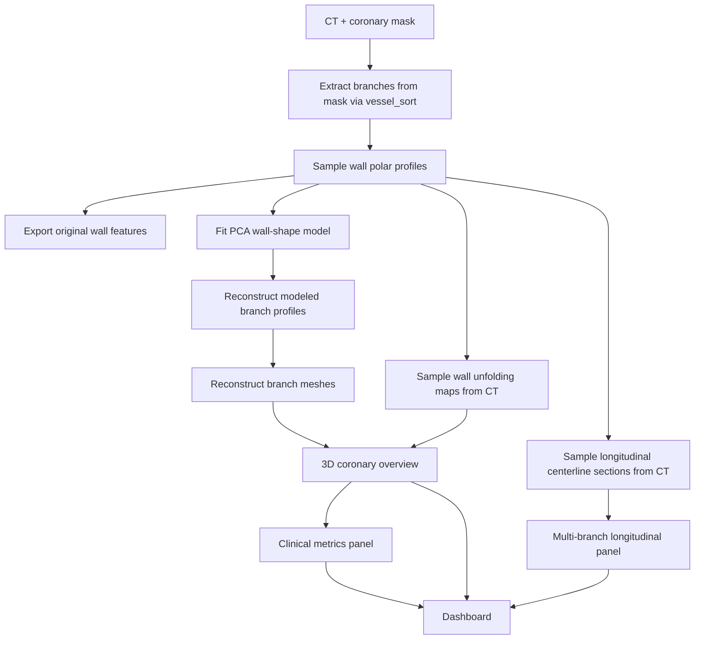

# Clinical Vessel Completion Workflow

This workflow packages three related coronary analysis tasks into one reproducible path:

1. Vessel completion from `CT + coronary mask`
2. Longitudinal vessel sections along selected centerlines
3. Common coronary measurements and dashboard reporting

The implementation lives in:

- `vessel_seg/clinical_completion.py`
- `scripts/run_clinical_completion_demo.py`

## Pipeline



## Inputs

- `--ct`: CCTA volume (`.nii` / `.nii.gz`)
- `--mask`: binary coronary mask
- `--case`: optional case id
- `--out-dir`: optional output directory
- `--centerline-backend`: `vessel_sort` (default) or `shape`
- `--longitudinal-width-mm`: width of the longitudinal section plane
- `--longitudinal-slab-mm`: slab thickness orthogonal to the section plane
- `--longitudinal-out-width-px`: output width of each longitudinal section image

Default demo input is `ASOCA2020 Normal_1`.

## Outputs

Recommended output root:

- `outputs_reorganized/cases/<case>/analysis/clinical_completion_default/`

Main artifacts:

- `features_original/`
  - branch-wise polar wall features
- `features_modeled/`
  - PCA-modeled branch wall features
- `meshes_original/`
  - reconstructed branch vessel-wall meshes
- `meshes_modeled/`
  - modeled branch vessel-wall meshes
- `centerline_sort/`
  - `vessel_sort` centerline VTP, tree JSON, exported clean branches
- `unfoldings/*.npy`
  - circumferential wall maps used for wall-HU statistics
- `longitudinal_sections/*.npy`
  - centerline-aligned vessel longitudinal sections for display
- `branch_metrics.json`
- `branch_metrics.csv`
- `case_summary.json`
- `pipeline_report.json`
- `dashboard.png`

## Display Layout

The generated dashboard uses the requested layout:

- Upper-left: 3D coronary overview, different vessel segments in different wall colors
- Lower-left: several centerline-aligned longitudinal vessel sections
- Right: clinician-oriented quantitative parameters

## Example

```bash
python -m vessel_seg clinical-demo \
  --ct ASOCA2020/Normal/CTCA_nii/Normal_1.nii.gz \
  --mask ASOCA2020/Normal/Annotations_nii/Normal_1.nii.gz \
  --case Normal_1
```

Legacy wrapper:

```bash
python scripts/run_clinical_completion_demo.py \
  --ct ASOCA2020/Normal/CTCA_nii/Normal_1.nii.gz \
  --mask ASOCA2020/Normal/Annotations_nii/Normal_1.nii.gz \
  --case Normal_1
```

## Metric Set

Per branch:

- `length_mm`
- `mean_radius_mm`
- `min_radius_mm`
- `mean_diameter_mm`
- `min_diameter_mm`
- `mean_area_mm2`
- `min_area_mm2`
- `tortuosity_index`
- `curvature_mean`
- `curvature_max`
- `stenosis_pct` (proximal reference proxy)
- `eccentricity_mean`
- `branch_confidence`
- `wall_hu_mean`
- `wall_hu_std`
- `high_hu_wall_fraction`

Case summary:

- branch count
- total centerline length
- weighted mean diameter
- global minimum diameter and branch
- maximum stenosis proxy and branch
- maximum curvature and branch
- mean wall HU
- mean high-HU wall fraction

## Notes

- This workflow currently treats the mask-derived contour as the main vessel-wall proxy.
- The longitudinal section is a CPR-like centerline-aligned slab view, not invasive IVUS.
- The wall maps are still kept as quantitative artifacts for wall-HU and plaque-proxy statistics.
- Centerline repair remains an optional upstream step and is not hardwired into this workflow yet.
