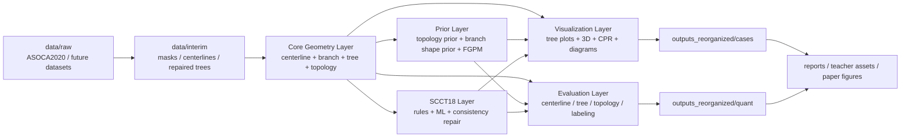
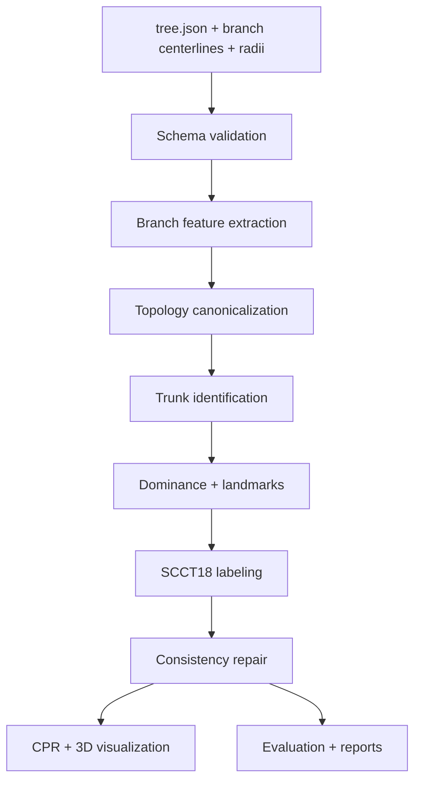
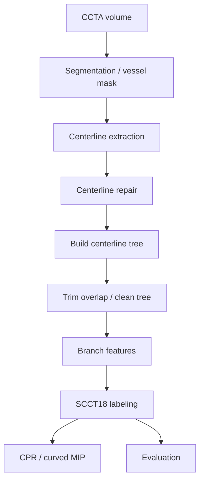
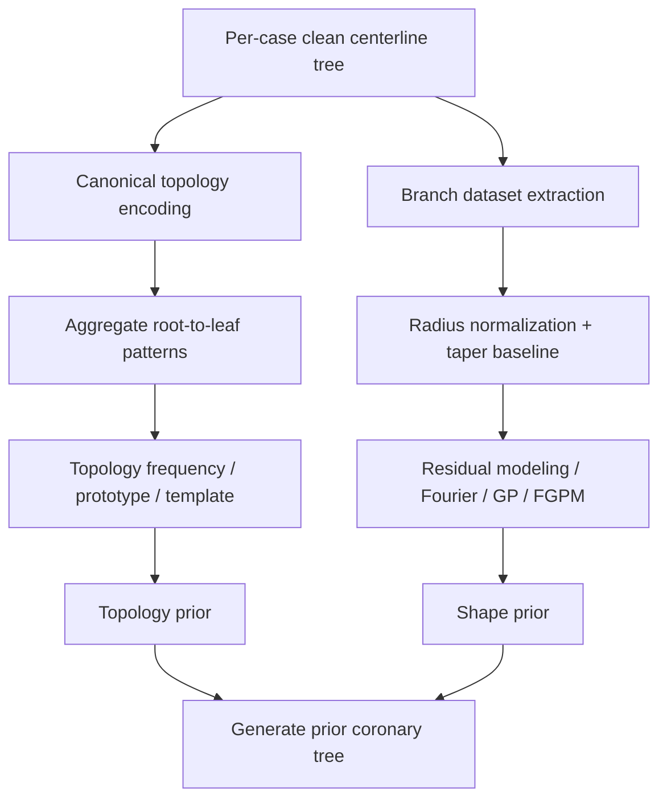
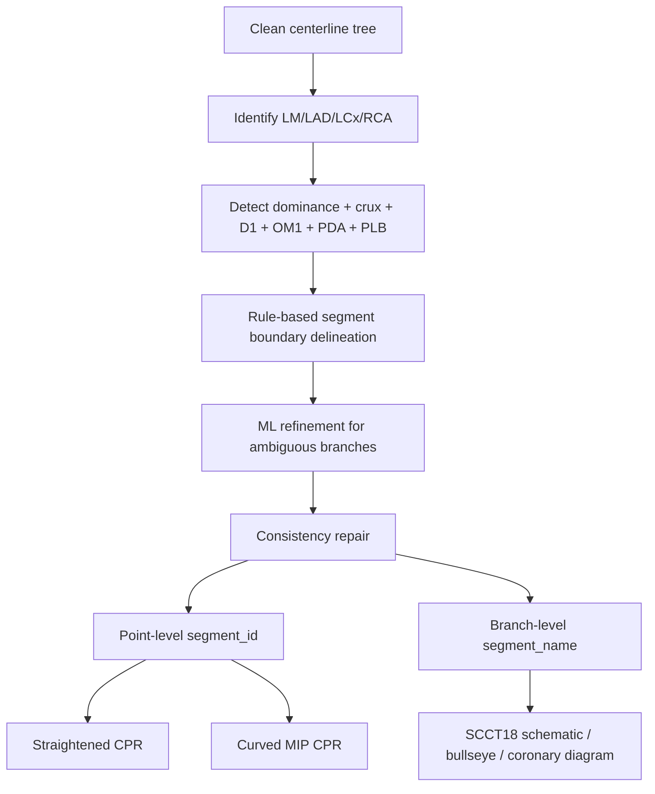

# Coronary Analysis Master Blueprint

## 1. Executive Summary

- 当前仓库已经具备冠状动脉分析平台的核心雏形，但仍是“研究脚本集合”，尚未完全沉淀为稳定工程。
- 项目主线应统一为：`CCTA / centerline tree -> topology prior -> branch shape prior -> SCCT18 labeling -> CPR / report visualization`。
- 现阶段最重要的建设不是再增加单点算法，而是统一数据结构、输出规范、case manifest、评估契约和模块边界。
- 该项目不应被定义为“单纯分割”，而应被定义为“冠脉结构化理解平台”：分割只是入口，目标是结构、标签、几何、先验、可视化和定量分析。
- 推荐采用“规则层 + 学习层 + 一致性修正”的 SCCT18 方案；推荐采用“拓扑先验 + branch radius prior + centerline repair”的几何主线。
- 推荐继续保留 legacy `ASOCA2020/` 和 `outputs/` 路径，新增标准化入口 `data/` 与 `outputs_reorganized/`，逐步切换脚本默认输出。
- 所有主流程都应围绕统一 schema 输出：`case manifest`、`centerline tree`、`branch features`、`topology prior`、`SCCT18 labels`、`CPR artifacts`、`evaluation report`。
- 工程上最值得优先固化的 5 件事：稳定中心线树、稳定数据/输出规范、稳定评估契约、SCCT18 分类框架、临床风格可视化。

## 2. System Architecture



## 3. End-to-End Pipelines

### 3.1 Mode A: Existing Centerline Tree



### 3.2 Mode B: Volume Only



### 3.3 Topology / Prior Pipeline



### 3.4 SCCT18 + CPR Visualization Pipeline



## 4. Data Model / File Formats

### 4.1 Case Manifest

```python
@dataclass
class CaseManifest:
    schema_version: str
    case_id: str
    dataset: str
    cohort: str  # Normal / Diseased / External
    ct_path: str | None
    mask_path: str | None
    centerline_path: str | None
    spacing_mm: tuple[float, float, float] | None
    origin_mm: tuple[float, float, float] | None
    official_outputs_root: str | None
    reorganized_outputs_root: str | None
    notes: str | None
```

Required:
- `schema_version`
- `case_id`
- `dataset`
- `cohort`

Optional:
- paths
- geometry metadata
- notes

Versioning:
- semantic string like `1.0.0`

Backward compatibility:
- keep unknown fields pass-through
- never rename required fields without migration helper

### 4.2 Centerline Tree Schema

```python
@dataclass
class TreeNode:
    branch_id: str
    parent_id: str | None
    points_path: str
    radii_path: str | None
    length_mm: float
    lambda_pos: float | None
    theta_deg: float | None
    phi_deg: float | None
    tags: list[str]

@dataclass
class CenterlineTree:
    schema_version: str
    case_id: str
    roots: list[str]
    nodes: list[TreeNode]
    metadata: dict
```

### 4.3 Branch Features Schema

```python
@dataclass
class BranchFeature:
    branch_id: str
    parent_id: str | None
    length_mm: float
    mean_radius_mm: float | None
    max_radius_mm: float | None
    curvature_mean: float | None
    curvature_max: float | None
    direction_vec: tuple[float, float, float] | None
    depth: int
    child_count: int
    side_hint: str | None
    trunk_hint: str | None
```

### 4.4 Topology Prior Schema

```python
@dataclass
class TopologyPrior:
    schema_version: str
    dataset: str
    case_count: int
    root_patterns: list[dict]
    root_to_leaf_patterns: list[dict]
    branch_count_stats: dict
    left_right_split_rules: dict
    prototype_tree: dict
```

### 4.5 SCCT18 Labels Schema

```python
@dataclass
class Landmark:
    branch_id: str
    point_index: int
    xyz_mm: tuple[float, float, float]
    confidence: float

@dataclass
class SegmentAssignment:
    branch_id: str
    segment_id: int | None
    segment_name: str | None
    start_idx: int
    end_idx: int
    confidence: float

@dataclass
class SCCT18Result:
    schema_version: str
    case_id: str
    dominance: str  # Right / Left / Co / Unknown
    landmarks: dict[str, Landmark]
    segments: list[SegmentAssignment]
    point_labels: dict[str, list[int | None]]
    warnings: list[str]
```

### 4.6 CPR Output Schema

```python
@dataclass
class CPROutput:
    schema_version: str
    case_id: str
    branch_id: str | None
    mode: str  # straightened / curved_mip
    image_path: str
    array_path: str | None
    width_mm: float
    slab_mm: float
    step_mm: float
    frame_debug_path: str | None
```

### 4.7 Evaluation Report Schema

```python
@dataclass
class EvaluationReport:
    schema_version: str
    case_id: str
    stage: str
    metrics: dict[str, float | int | str]
    artifacts: dict[str, str]
    warnings: list[str]
```

### 4.8 JSON Example

```json
{
  "schema_version": "1.0.0",
  "case_id": "Normal_1",
  "dominance": "Right",
  "landmarks": {
    "lm_bifurcation": {
      "branch_id": "branch_3",
      "point_index": 18,
      "xyz_mm": [12.3, -40.1, 5.2],
      "confidence": 0.93
    },
    "pda_origin": {
      "branch_id": "branch_1",
      "point_index": 74,
      "xyz_mm": [32.0, -18.4, -11.2],
      "confidence": 0.88
    }
  },
  "segments": [
    {
      "branch_id": "branch_3",
      "segment_id": 5,
      "segment_name": "LM",
      "start_idx": 0,
      "end_idx": 18,
      "confidence": 0.95
    },
    {
      "branch_id": "branch_4",
      "segment_id": 6,
      "segment_name": "pLAD",
      "start_idx": 0,
      "end_idx": 31,
      "confidence": 0.89
    }
  ],
  "point_labels": {
    "branch_4": [6, 6, 6, 7, 7, 7, 8, 8, null]
  },
  "warnings": []
}
```

## 5. Repository Structure

```text
vessel_seg/
├── data/
│   ├── raw/
│   ├── interim/
│   ├── processed/
│   └── external/
├── outputs/
├── outputs_reorganized/
│   ├── cases/
│   ├── quant/
│   ├── aggregate/
│   ├── reports/
│   └── archive/
├── configs/
│   ├── datasets/
│   ├── labeling/
│   ├── prior/
│   └── visualization/
├── vessel_seg/
│   ├── io/
│   ├── centerline/
│   ├── tree/
│   ├── topology/
│   ├── prior/
│   ├── labeling/
│   ├── visualization/
│   ├── evaluation/
│   ├── schemas/
│   ├── cli.py
│   └── workflows.py
├── scripts/
│   ├── migrate_outputs_layout.py
│   ├── audit_data_outputs.py
│   └── legacy_*.py
├── docs/
├── notebooks/
├── tests/
└── reports/
```

### Responsibilities

- `data/`: 标准化数据根目录，不放临时结果
- `outputs_reorganized/`: 正式组织后的结果目录
- `vessel_seg/`: 可复用库逻辑，未来主入口
- `scripts/`: 一次性迁移脚本、兼容 wrapper、手工实验入口
- `notebooks/`: 只做探索、展示，不承载主流程逻辑
- `docs/`: 设计文档、实验总结、汇报稿
- `reports/`: 可直接投老师/投论文的图件与导出物

Package 应承载：
- schema
- I/O
- geometry
- tree/topology
- prior
- labeling
- CPR
- evaluation
- workflow orchestration

Scripts 应保留：
- migration
- one-off conversion
- debugging wrappers

## 6. Task Backlog

| Task ID | Title | Objective | Input | Output | Dependency | Priority | Expected Artifacts |
|---|---|---|---|---|---|---|---|
| REP-001 | Normalize package boundaries | 把核心逻辑从 scripts 收入 package | current repo | stable package map | none | P0 | package map doc |
| REP-002 | Introduce schema registry | 统一 schema version 和校验入口 | json/dataclass | validators | REP-001 | P0 | schema module |
| REP-003 | Redirect default outputs | 让新流程默认写入 outputs_reorganized | current scripts | new default paths | REP-001 | P0 | CLI patch list |
| REP-004 | Legacy path compatibility layer | 旧脚本仍可读旧目录 | old outputs | compatibility helpers | REP-003 | P1 | resolver module |
| DAT-001 | Build case manifest generator | 统一生成 case 元数据 | ASOCA2020 | manifest.json | REP-002 | P0 | manifest generator |
| DAT-002 | Raw/interim/processed policy | 固化数据职责边界 | data roots | policy doc | none | P0 | docs + config |
| DAT-003 | Output manifest per case | 每个 case 记录主要产物 | case outputs | manifest.json | DAT-001 | P0 | per-case manifest |
| DAT-004 | Result index builder | 自动汇总 case 输出 | outputs_reorganized | index.json | DAT-003 | P1 | index builder |
| CLN-001 | Stabilize centerline extraction contract | 固化 mask->centerline 输入输出 | mask | centerline vtp + report | REP-002 | P0 | extraction contract |
| CLN-002 | Add centerline coordinate mode metadata | 避免坐标系混乱 | centerline outputs | transform metadata | CLN-001 | P0 | metadata fields |
| CLN-003 | Repair report standardization | 统一 repair 输出和指标 | repaired vtp | repair report schema | CLN-001 | P0 | report schema |
| CLN-004 | Centerline completeness metric | 定义完整性指标 | pred/gt centerline | metrics | CLN-001 | P1 | evaluation metric |
| TRE-001 | Canonical clean tree definition | 明确 clean tree 条件 | repaired centerlines | canonical tree | CLN-003 | P0 | tree spec |
| TRE-002 | Parent attachment stabilizer | 稳定 parent/lambda/theta/phi | polylines | stable tree edges | TRE-001 | P0 | attachment module |
| TRE-003 | Overlap trim validator | 检查 trim 前后拓扑 | tree + branches | validation report | TRE-001 | P0 | trim validator |
| TRE-004 | Multi-root handling policy | 定义异常 root 的处理规则 | tree | root policy | TRE-001 | P1 | policy doc |
| TRE-005 | Tree manifest | 输出树级摘要信息 | tree.json | summary.json | TRE-001 | P1 | tree manifest |
| TOP-001 | Canonical topology encoding | 统一 root-to-leaf 表达 | clean tree | canonical encoding | TRE-001 | P0 | encoding module |
| TOP-002 | Left/right split rule formalization | 统一左右系统定义 | canonical tree | split labels | TOP-001 | P0 | side split rules |
| TOP-003 | Topology frequency statistics | 统计模式频率 | all cases | frequency tables | TOP-001 | P0 | aggregate tables |
| TOP-004 | Prototype tree builder | 生成平均意义下模板树 | aggregate trees | prototype.json | TOP-003 | P1 | prototype tree |
| TOP-005 | Topology consistency score | 量化树结构合法性 | predicted tree | score | TOP-001 | P1 | scoring module |
| BRN-001 | Branch feature schema | 统一几何特征格式 | branch centerlines | feature files | REP-002 | P0 | feature schema |
| BRN-002 | Length/radius/curvature extraction | 固化基础特征 | branches | feature arrays | BRN-001 | P0 | feature extractor |
| BRN-003 | Heart-relative orientation feature | 加入方位特征 | branches + coords | orientation features | BRN-002 | P1 | orientation module |
| SHP-001 | Normalize xi + taper baseline | 固化分支归一化建模 | branch radii | detrended representation | BRN-002 | P0 | modeling utils |
| SHP-002 | Residual radius modeling | 显式建模局部残差 | detrended branches | residual features | SHP-001 | P0 | residual model |
| SHP-003 | FGPM standardized training I/O | 统一先验训练格式 | branch dataset | fgpm_model.npz | SHP-001 | P0 | fgpm trainer |
| SHP-004 | Prior sampling contract | 长度+初始截面生成血管 | prior + controls | sampled vessel | SHP-003 | P1 | sampling API |
| SHP-005 | Prior-vs-GT error analysis | 比较先验和真实形态 | prior mesh + GT | error report | SHP-004 | P1 | evaluation module |
| LAB-001 | SCCT ontology config | 固化 18 段名称、ID、约束 | SCCT spec | config file | none | P0 | labeling config |
| LAB-002 | Trunk identification rules | 识别 LM/LAD/LCx/RCA | clean tree | trunk tags | TRE-002 | P0 | trunk module |
| LAB-003 | Dominance detection rules | 判断 Right/Left/Co | clean tree | dominance | LAB-002 | P0 | dominance module |
| LAB-004 | Landmark detector | 检测 D1/OM1/crux/PDA/PLB | tree + features | landmarks | LAB-002 | P0 | landmark module |
| LAB-005 | Rule-based segment boundary delineation | 切 proximal/mid/dist | trunks + landmarks | segment spans | LAB-004 | P0 | boundary module |
| LAB-006 | Point-level segment assignment | 输出点级 segment_id | boundaries | point labels | LAB-005 | P0 | label writer |
| LAB-007 | Ambiguous branch classifier | 用 ML 处理歧义分支 | features + weak labels | refined labels | LAB-006 | P1 | model interface |
| LAB-008 | Consistency repair engine | 修正不合法标签关系 | raw labels | corrected labels | LAB-007 | P0 | repair module |
| LAB-009 | SCCT18 schema output | 输出标准标签文件 | labels | scct18.json | LAB-006 | P0 | schema output |
| VIS-001 | Canonical 3D centerline viewer | 统一 3D 结构可视化 | tree + labels | 3D plots | TRE-001 | P1 | viewer module |
| VIS-002 | Topology tree renderer | 画符合冠脉语义的树图 | topology | tree figures | TOP-001 | P1 | renderer |
| VIS-003 | CPR contract | 固化 straightened/curved MIP 接口 | volume + centerline | cpr artifacts | CLN-001 | P0 | cpr schema |
| VIS-004 | SCCT18 overlay on CPR | 在 CPR 上叠加分段标签 | cpr + labels | overlays | LAB-006 | P1 | overlay module |
| VIS-005 | Coronary schematic generator | 生成 18 段示意图 | scct18 labels | colored diagram | LAB-009 | P1 | schematic renderer |
| VIS-006 | Teacher report asset pipeline | 自动导出汇报图 | metrics + figures | report assets | VIS-001 | P2 | asset scripts |
| EVA-001 | Centerline metric suite | 长度、覆盖、距离等 | pred/gt centerline | metrics.json | CLN-001 | P0 | metric suite |
| EVA-002 | Tree topology metric suite | 结构一致性量化 | pred/gt tree | metrics.json | TRE-001 | P0 | topology metrics |
| EVA-003 | Prior fidelity metric suite | 先验重建误差 | prior + gt | metrics | SHP-005 | P1 | fidelity metrics |
| EVA-004 | SCCT18 metric suite | 段级准确率/边界误差 | labels + gt | reports | LAB-009 | P0 | labeling metrics |
| EVA-005 | Runtime/reproducibility contracts | 性能和复现评估 | workflow run | contracts | REP-001 | P1 | perf contracts |
| TST-001 | Schema validation tests | 保证所有 schema 稳定 | sample json | passing tests | REP-002 | P0 | test file |
| TST-002 | Tree construction regression tests | 防止树结构退化 | toy trees | passing tests | TRE-002 | P0 | regression tests |
| TST-003 | Overlap trimming tests | 防止父子重叠回退 | synthetic branches | expected trim | TRE-003 | P0 | unit tests |
| TST-004 | SCCT18 labeling tests | 验证 segment mapping | toy coronary trees | expected labels | LAB-006 | P0 | unit tests |
| TST-005 | CPR geometry tests | 验证 RMF / sampling | synthetic volume | expected slices | VIS-003 | P1 | unit tests |
| DOC-001 | Single-source workflow docs | 一个总文档统领全局 | current docs | unified docs | REP-001 | P0 | docs index |
| DOC-002 | Case study templates | 统一单病例分析模板 | case outputs | md templates | DAT-003 | P1 | templates |
| DOC-003 | Error analysis template | 统一失败分析格式 | evaluation outputs | report template | EVA-001 | P1 | template |

## 7. Algorithm Design Details

### 7.1 Centerline

Input:
- mask or VTP

Output:
- repaired centerline
- clean centerline tree

Key objects:
- polyline branch
- branch endpoint
- attachment projection
- overlap prefix

Key assumptions:
- 分支可由 polyline 近似
- 父子连接可由起点到父支最短投影近似

Failure modes:
- 坐标系不一致
- 父子共享长前缀
- 分叉点附着错误
- repair 过度桥接

Fixes:
- 统一 transform metadata
- overlap trim validator
- attachment confidence
- repair report with candidate ranking

### 7.2 Topology

Input:
- clean tree

Output:
- canonical topology encoding
- root-to-leaf pattern
- topology frequency table
- prototype tree

Key objects:
- root
- side split
- canonical sibling order
- path pattern

Key assumptions:
- 同一病例树可映射到 canonical topology graph
- 左右系统应先于深层结构比较

Failure modes:
- 左右分支混淆
- sibling order 混乱
- path collapse

Fixes:
- side rule independent from branch count
- GT-root based ordering when available
- canonical ordering stored explicitly

### 7.3 Prior Modeling

Input:
- branch radii tensor
- length
- optional initial radius

Output:
- topology prior
- branch shape prior
- sampled vessel mesh

Key objects:
- xi in [0,1]
- exponential taper baseline
- residual radius
- Fourier / GP coefficients

Key assumptions:
- 长度与截面变化可分解为 baseline + residual
- 不同分支共享可比较的 normalized coordinate

Failure modes:
- 过度压平 distal taper
- branch types 混合导致 prior 发散
- 对齐误差污染训练

Fixes:
- 按分支类型或 trunk 分层
- baseline/residual 分离
- training set QC with alignment scores

### 7.4 SCCT18 Labeling

Input:
- clean tree
- branch features
- landmarks

Output:
- point-level segment_id
- branch-level segment_name
- dominance

Key objects:
- trunk
- dominance
- RI
- PDA/PLB ownership
- proximal/mid/dist boundaries

Key assumptions:
- SCCT18 可以先由 trunk + landmark + consistency 定义
- ML 只用于 ambiguous case，而不是全盘替代规则

Failure modes:
- LM 与 RCA root 误判
- D1 / OM1 锚点缺失
- PDA/PLB 归属歧义
- RI 误触发

Fixes:
- rule-first
- fallback to proportion boundaries
- topology consistency repair
- confidence + warning output

### 7.5 CPR

Input:
- volume
- centerline

Output:
- straightened CPR
- curved MIP CPR
- debug frames

Key objects:
- RMF frame
- resampled centerline
- slab MIP
- window/normalize

Key assumptions:
- RMF 比 Frenet 更稳定
- slab MIP 更接近工作站视觉效果

Failure modes:
- 中心线不在 volume 内
- frame 抖动
- overlay 错位

Fixes:
- coordinate mode detection
- RMF smoothing
- debug dump of t/n/b and in-bounds ratio

## 8. Python Project Skeleton

```text
vessel_seg/
├── schemas/
│   ├── case_manifest.py
│   ├── centerline_tree.py
│   ├── branch_features.py
│   ├── scct18.py
│   └── evaluation.py
├── io/
│   ├── asoca.py
│   ├── vtp.py
│   ├── nifti.py
│   └── manifest.py
├── centerline/
│   ├── extract.py
│   ├── repair.py
│   ├── trim_overlap.py
│   └── evaluate.py
├── tree/
│   ├── build.py
│   ├── canonicalize.py
│   └── features.py
├── topology/
│   ├── encode.py
│   ├── aggregate.py
│   ├── prototype.py
│   └── visualize.py
├── prior/
│   ├── branch_dataset.py
│   ├── taper.py
│   ├── fgpm_model.py
│   ├── sample.py
│   └── evaluate.py
├── labeling/
│   ├── ontology.py
│   ├── trunks.py
│   ├── dominance.py
│   ├── landmarks.py
│   ├── rules.py
│   ├── refine.py
│   └── consistency.py
├── visualization/
│   ├── tree_3d.py
│   ├── cpr.py
│   ├── scct18_diagram.py
│   └── report_assets.py
├── evaluation/
│   ├── centerline_metrics.py
│   ├── topology_metrics.py
│   ├── label_metrics.py
│   └── reports.py
├── workflows.py
└── cli.py
```

### Core interfaces

```python
def build_clean_tree(vtp_path: Path, *, trim_overlap: bool = True) -> CenterlineTree: ...
def extract_branch_features(tree: CenterlineTree) -> list[BranchFeature]: ...
def encode_topology(tree: CenterlineTree) -> dict: ...
def fit_branch_prior(dataset_npz: Path) -> Path: ...
def detect_landmarks(tree: CenterlineTree, features: list[BranchFeature]) -> dict[str, Landmark]: ...
def classify_scct18(tree: CenterlineTree, features: list[BranchFeature]) -> SCCT18Result: ...
def generate_straightened_cpr(volume: np.ndarray, centerline_mm: np.ndarray, ...) -> CPROutput: ...
def generate_curved_mip_cpr(volume: np.ndarray, centerline_mm: np.ndarray, ...) -> CPROutput: ...
def evaluate_scct18(pred: SCCT18Result, gt: SCCT18Result) -> EvaluationReport: ...
```

### Workflow pseudocode

```python
def run_case_mode_a(case_manifest: CaseManifest) -> None:
    tree = load_tree(case_manifest.centerline_path)
    clean_tree = canonicalize_tree(tree)
    features = extract_branch_features(clean_tree)
    topology = encode_topology(clean_tree)
    labels = classify_scct18(clean_tree, features)
    save_tree(clean_tree)
    save_features(features)
    save_topology(topology)
    save_labels(labels)
    render_case_outputs(clean_tree, labels)
```

## 9. Test Plan

| Test ID | Objective | Toy Input | Expected Output | Failure Signal |
|---|---|---|---|---|
| TEST-001 | case manifest schema valid | minimal manifest json | validation pass | missing required field |
| TEST-002 | tree schema roundtrip | toy tree | load/save equal | branch fields lost |
| TEST-003 | parent attachment stable | simple Y tree | correct parent_id/lambda | wrong parent |
| TEST-004 | overlap trim works | parent+child shared prefix | child prefix removed | residual overlap |
| TEST-005 | clean tree canonicalization stable | reordered children | same canonical tree | order drift |
| TEST-006 | topology encoding stable | same tree with new ids | same path patterns | id-dependent encoding |
| TEST-007 | taper baseline fit reasonable | synthetic exponential taper | alpha close to GT | fit diverges |
| TEST-008 | FGPM sample shape valid | toy prior | non-negative radii | negative / NaN radii |
| TEST-009 | dominance rule correct | toy RCA-dominant tree | Right | wrong ownership |
| TEST-010 | RI only at LM trifurcation | bifurcation/trifurcation toys | RI only once | RI false positive |
| TEST-011 | landmark detector fallback | no D1 toy tree | proportion fallback | missing labels |
| TEST-012 | SCCT18 consistency repair | conflicting raw labels | repaired valid sequence | impossible segment order |
| TEST-013 | CPR geometry stable | straight synthetic centerline | no rotation jitter | frame flips |
| TEST-014 | migration script idempotent | rerun migration | skipped/copied as expected | duplicated corruption |
| TEST-015 | metrics report contract | synthetic pred/gt | metrics.json complete | missing keys |

## 10. Risk Register

| Risk | Why It Matters | Mitigation |
|---|---|---|
| 坐标系不一致 | 导致 CPR、centerline、mask 全部错位 | 每个 artifact 强制写 transform metadata |
| clean tree 定义不统一 | 后续 topology/SCCT18 全部不稳定 | 先固化 canonical clean tree spec |
| 左右系统规则漂移 | topology prior 与 labeling 全错 | 在 topology schema 中显式 side split |
| PDA/PLB 归属歧义 | dominance、SCCT18、示意图都会错 | dominance first，再定 PDA/PLB ownership |
| RI 误判 | SCCT18 17 段污染 | RI 仅在 LM trifurcation + confidence 足够时触发 |
| 分支类型混训 | shape prior 发散 | trunk-aware / segment-aware 分层训练 |
| 输出目录继续分叉 | 以后所有脚本又会重新变乱 | 尽快把 CLI 默认 out-root 切到 outputs_reorganized |
| notebook 继续承载主逻辑 | 不可测试、不可回归 | notebook 仅展示，核心逻辑全部包内化 |
| 临床图和算法图混用 | 报告难复现 | report assets pipeline 单独管理 |
| 任务面太宽导致发散 | 研究推进失焦 | 所有新增任务必须挂到五条主线上 |

## 11. Immediate Action Set

### Most valuable next 20 tasks

1. 定义 `clean centerline tree` 的正式标准。
2. 给 tree / features / labels / evaluation 建立统一 schema。
3. 把脚本默认输出根切到 `outputs_reorganized/`。
4. 为每个 case 生成 `manifest.json`。
5. 固化 overlap trimming 的验证逻辑。
6. 把 parent/lambda/theta/phi 的计算提取成独立模块。
7. 把 topology encoding 固化成 canonical form。
8. 统一左右系统的 split 规则。
9. 统一 branch feature 提取格式。
10. 固化 xi + taper baseline + residual 表达。
11. 统一 FGPM 训练输入输出。
12. 定义 SCCT18 ontology config。
13. 先实现纯规则版 SCCT18。
14. 增加 dominance detector。
15. 增加 landmark detector。
16. 增加 SCCT18 consistency repair。
17. 固化 CPR contract 与 debug 输出。
18. 固化 evaluation report contract。
19. 建立 schema/trim/tree/SCCT18 的回归测试。
20. 建立 teacher-report / paper-figure 自动导出入口。

### 10 tasks that should not be prioritized now

1. 直接训练大模型替代全部规则。
2. 过早引入复杂 GNN 作为主干。
3. 在 schema 没稳定前大规模重命名所有文件。
4. 在 clean tree 不稳定前做大规模 topology prior 论文结论。
5. 在 SCCT18 ontology 未固化前做分类 benchmark。
6. 在 CPR 坐标还不稳定前做临床对比图定量结论。
7. 一开始就做多数据集联合训练。
8. 过早追求 GUI 应用化。
9. 把所有 notebook 全删掉。
10. 同时推进 stenosis、plaque、FFR 三条新主线。

### Minimal viable pipeline

`ASOCA case -> clean tree -> branch features -> rule-based SCCT18 -> CPR -> evaluation report`

### Paper-oriented pipeline

`clean tree + topology prior + branch shape prior + SCCT18 + clinical-style visualization + quantitative evaluation`

### Engineering-oriented pipeline

`schema + package + workflows + outputs_reorganized + contract tests + reproducible reports`

### Clinical demo-oriented pipeline

`case manifest -> clean tree -> SCCT18 labels -> curved MIP overlay -> coronary schematic -> teacher report assets`
